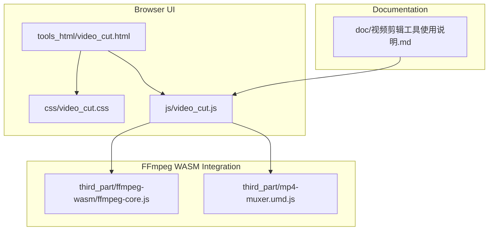
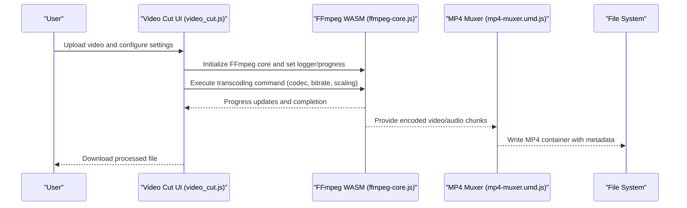
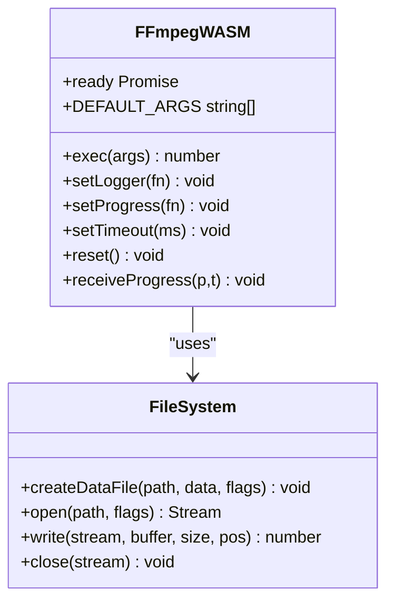
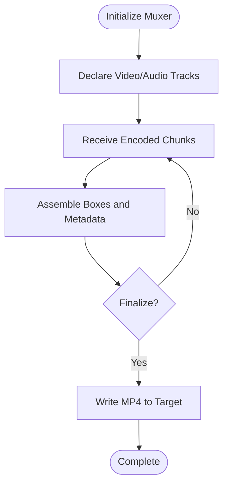
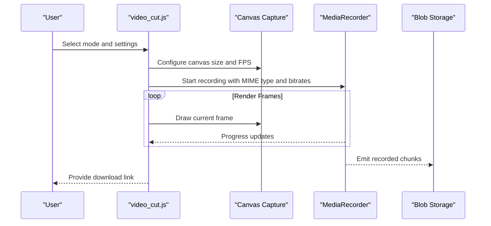
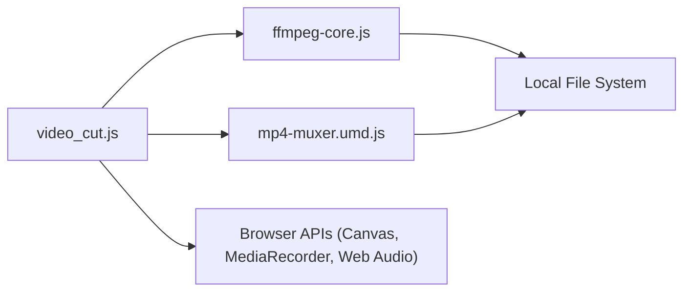

# Video Format Conversion

<cite>
**Referenced Files in This Document**
- [video_cut.html](file://tools_html/video_cut.html)
- [video_cut.js](file://js/video_cut.js)
- [video_cut.css](file://css/video_cut.css)
- [ffmpeg-core.js](file://third_part/ffmpeg-wasm/ffmpeg-core.js)
- [mp4-muxer.umd.js](file://third_part/mp4-muxer.umd.js)
- [视频剪辑工具使用说明.md](file://doc/视频剪辑工具使用说明.md)
</cite>

## Table of Contents
1. [Introduction](#introduction)
2. [Project Structure](#project-structure)
3. [Core Components](#core-components)
4. [Architecture Overview](#architecture-overview)
5. [Detailed Component Analysis](#detailed-component-analysis)
6. [Dependency Analysis](#dependency-analysis)
7. [Performance Considerations](#performance-considerations)
8. [Troubleshooting Guide](#troubleshooting-guide)
9. [Conclusion](#conclusion)

## Introduction
This document describes the video format conversion tool implemented in the repository. It focuses on the browser-based video processing pipeline, including:
- Supported input/output formats
- Conversion workflows and codec selection
- Resolution scaling and quality optimization
- Implementation of FFmpeg WASM integration for transcoding
- Memory management and performance optimization
- Practical examples and export settings

The tool provides a WebAssembly-based FFmpeg integration for client-side video transcoding, enabling format conversion, scaling, and quality tuning directly in the browser.

## Project Structure
The video format conversion capability is primarily implemented in a single JavaScript module with associated HTML and CSS assets. The FFmpeg WASM integration is provided via a third-party module included in the repository.

**Diagram sources**
- [video_cut.html:1-28](file://tools_html/video_cut.html#L1-L28)
- [video_cut.js:1-688](file://js/video_cut.js#L1-L688)
- [video_cut.css:1-253](file://css/video_cut.css#L1-L253)
- [ffmpeg-core.js:1-22](file://third_part/ffmpeg-wasm/ffmpeg-core.js#L1-L22)
- [mp4-muxer.umd.js:1-6](file://third_part/mp4-muxer.umd.js#L1-L6)

**Section sources**
- [video_cut.html:1-28](file://tools_html/video_cut.html#L1-L28)
- [video_cut.js:1-688](file://js/video_cut.js#L1-L688)
- [video_cut.css:1-253](file://css/video_cut.css#L1-L253)
- [ffmpeg-core.js:1-22](file://third_part/ffmpeg-wasm/ffmpeg-core.js#L1-L22)
- [mp4-muxer.umd.js:1-6](file://third_part/mp4-muxer.umd.js#L1-L6)
- [视频剪辑工具使用说明.md:1-299](file://doc/视频剪辑工具使用说明.md#L1-L299)

## Core Components
- FFmpeg WASM core loader and runtime interface
- MP4 muxer for containerization of encoded streams
- Video processing UI and workflow orchestration
- Export and download mechanisms

Key responsibilities:
- FFmpeg WASM: Provides transcoding commands, logging, progress callbacks, and memory lifecycle management.
- MP4 Muxer: Assembles encoded video/audio chunks into an MP4 container with proper metadata.
- Video Cut UI: Manages user interactions, collects settings (bitrate, scaling), and orchestrates processing.

**Section sources**
- [ffmpeg-core.js:1-22](file://third_part/ffmpeg-wasm/ffmpeg-core.js#L1-L22)
- [mp4-muxer.umd.js:1-6](file://third_part/mp4-muxer.umd.js#L1-L6)
- [video_cut.js:1-688](file://js/video_cut.js#L1-L688)

## Architecture Overview
The system integrates a browser-based UI with FFmpeg WASM for transcoding and an MP4 muxer for packaging the output.

**Diagram sources**
- [video_cut.js:1-688](file://js/video_cut.js#L1-L688)
- [ffmpeg-core.js:1-22](file://third_part/ffmpeg-wasm/ffmpeg-core.js#L1-L22)
- [mp4-muxer.umd.js:1-6](file://third_part/mp4-muxer.umd.js#L1-L6)

## Detailed Component Analysis

### FFmpeg WASM Integration
The FFmpeg WASM module exposes:
- Initialization and readiness promise
- Command execution via a C-compatible interface
- Logging and progress callbacks
- Memory management helpers and heap resizing
- File system hooks for input/output

Implementation highlights:
- Ready promise ensures the WASM runtime is initialized before commands are executed.
- Logger and progress handlers are registered to surface status and progress to the UI.
- Memory growth and heap resizing are handled to accommodate large video processing tasks.
- File system integration allows reading input files and writing output containers.

**Diagram sources**
- [ffmpeg-core.js:1-22](file://third_part/ffmpeg-wasm/ffmpeg-core.js#L1-L22)

**Section sources**
- [ffmpeg-core.js:1-22](file://third_part/ffmpeg-wasm/ffmpeg-core.js#L1-L22)

### MP4 Muxer
The MP4 muxer handles:
- Container creation and metadata assembly
- Video/audio track registration
- Chunk ingestion and timing coordination
- Finalization and file emission

Key behaviors:
- Supports video codecs (AVC/H.264, HEVC/H.265, VP9, AV1) and audio codecs (AAC, Opus).
- Configurable fast-start options for progressive downloads.
- Robust timestamp handling and composition offsets.

**Diagram sources**
- [mp4-muxer.umd.js:1-6](file://third_part/mp4-muxer.umd.js#L1-L6)

**Section sources**
- [mp4-muxer.umd.js:1-6](file://third_part/mp4-muxer.umd.js#L1-L6)

### Video Processing Workflow (Browser-Based)
The UI orchestrates processing using browser APIs:
- Canvas capture for frame rendering
- MediaRecorder for streaming capture
- Web Audio for audio extraction and mixing
- Blob generation and download links

Processing modes:
- Trim: Captures frames between start/end times and records to WebM.
- Convert: Re-encodes to WebM with configurable video/audio bitrates.
- Snapshot: Extracts a single frame to PNG/JPEG/WebP.
- Audio Extract: Extracts audio track to WebM Opus.
- Mute: Produces a silent video by muting audio during capture.
- Speed: Adjusts playback rate and re-captures frames.

**Diagram sources**
- [video_cut.js:1-688](file://js/video_cut.js#L1-L688)

**Section sources**
- [video_cut.js:1-688](file://js/video_cut.js#L1-L688)
- [视频剪辑工具使用说明.md:206-274](file://doc/视频剪辑工具使用说明.md#L206-L274)

### Codec Selection and Quality Settings
- Video codecs: AVC/H.264, HEVC/H.265, VP9, AV1 (selected via muxer configuration).
- Audio codecs: AAC, Opus (selected via muxer configuration).
- Bitrate configuration: Adjustable per track in the UI; applied to MediaRecorder and muxer configurations.
- Resolution scaling: Controlled by canvas dimensions and draw operations; output container reflects scaled dimensions.

Practical guidance:
- Lower bitrates reduce file size but may impact perceived quality.
- Higher resolutions increase processing time and memory usage.
- Choose codecs based on target browser/device compatibility.

**Section sources**
- [video_cut.js:200-258](file://js/video_cut.js#L200-L258)
- [mp4-muxer.umd.js:1-6](file://third_part/mp4-muxer.umd.js#L1-L6)

### Export Settings and File Formats
- WebM: Default output for browser-native support (VP9 + Opus).
- MP4: Produced via muxer; supports AVC/H.264, HEVC/H.265, VP9, AV1 video and AAC/Opus audio.
- Image snapshots: PNG, JPEG, WebP with adjustable quality.

**Section sources**
- [video_cut.js:200-258](file://js/video_cut.js#L200-L258)
- [mp4-muxer.umd.js:1-6](file://third_part/mp4-muxer.umd.js#L1-L6)
- [视频剪辑工具使用说明.md:148-167](file://doc/视频剪辑工具使用说明.md#L148-L167)

## Dependency Analysis
The video processing pipeline depends on:
- FFmpeg WASM for transcoding
- MP4 muxer for containerization
- Browser APIs for capture and processing
- Local file system for input/output

**Diagram sources**
- [video_cut.js:1-688](file://js/video_cut.js#L1-L688)
- [ffmpeg-core.js:1-22](file://third_part/ffmpeg-wasm/ffmpeg-core.js#L1-L22)
- [mp4-muxer.umd.js:1-6](file://third_part/mp4-muxer.umd.js#L1-L6)

**Section sources**
- [video_cut.js:1-688](file://js/video_cut.js#L1-L688)
- [ffmpeg-core.js:1-22](file://third_part/ffmpeg-wasm/ffmpeg-core.js#L1-L22)
- [mp4-muxer.umd.js:1-6](file://third_part/mp4-muxer.umd.js#L1-L6)

## Performance Considerations
- Memory management: Heap resizing and buffer growth are essential for large videos; monitor memory usage and avoid unnecessary allocations.
- Bitrate tuning: Reduce video/audio bitrates to lower CPU usage and memory pressure.
- Resolution scaling: Downscale input frames to reduce workload.
- Browser choice: Modern browsers offer better performance for MediaRecorder and WebAssembly.
- Progressive handling: Use fast-start options for MP4 to enable early playback.

[No sources needed since this section provides general guidance]

## Troubleshooting Guide
Common issues and remedies:
- Large file processing causing browser instability:
  - Close other tabs to free memory.
  - Split the video into smaller segments.
  - Use performance mode on desktop OS.
- Codec compatibility:
  - Prefer WebM for broad browser support.
  - Convert to MP4 externally if required.
- Mobile device limitations:
  - MediaRecorder support varies; test on target devices.
  - Avoid processing very large files on mobile.

**Section sources**
- [视频剪辑工具使用说明.md:206-274](file://doc/视频剪辑工具使用说明.md#L206-L274)

## Conclusion
The video format conversion tool leverages FFmpeg WASM for powerful transcoding capabilities within the browser, combined with a robust MP4 muxer for packaging outputs. The UI provides straightforward controls for bitrate, codec selection, and resolution scaling, while performance and memory considerations are addressed through careful configuration and browser-native APIs. For advanced workflows or MP4-specific needs, external conversion steps can complement the browser-based processing.