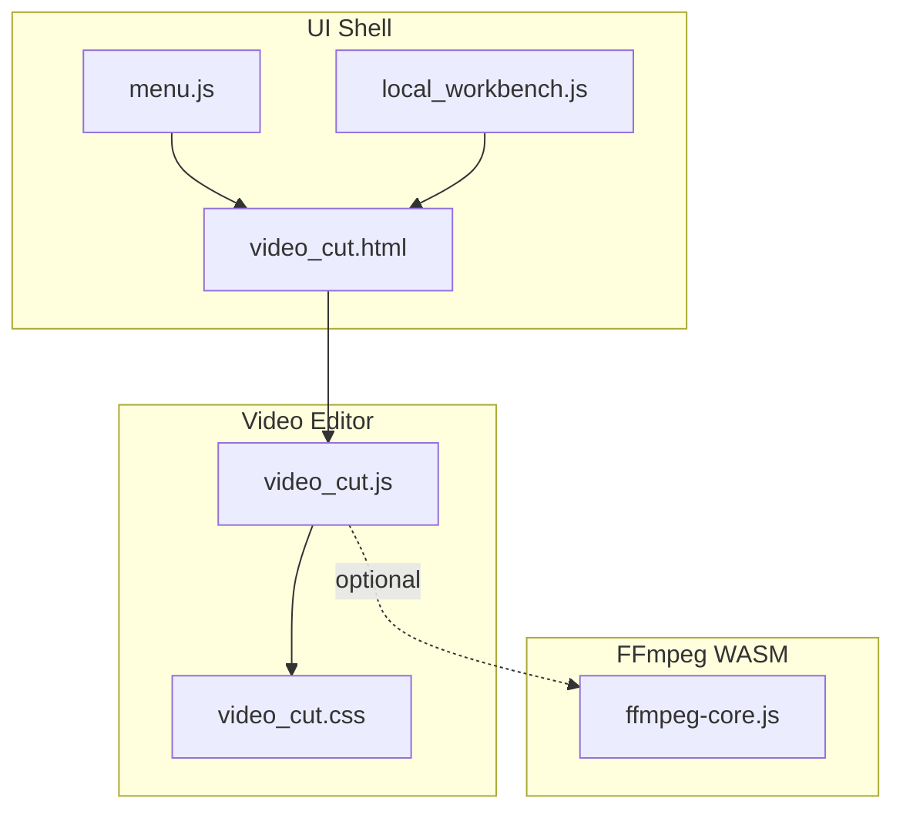
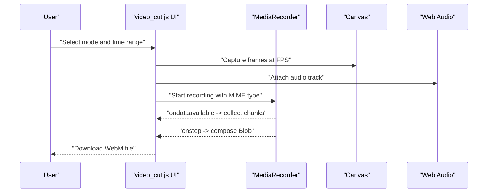
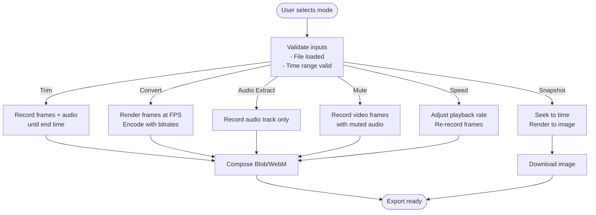
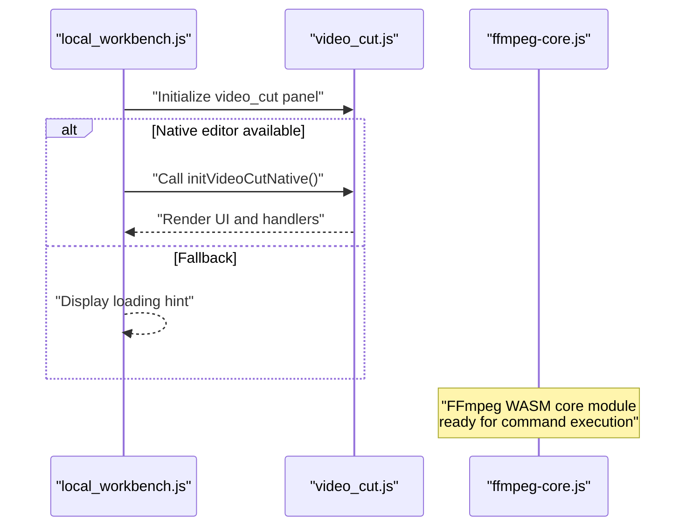
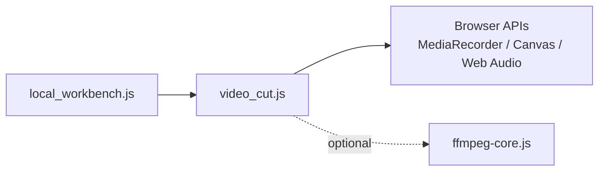

# Video Processing Tools

<cite>
**Referenced Files in This Document**
- [video_cut.js](file://js/video_cut.js)
- [video_cut.html](file://tools_html/video_cut.html)
- [video_cut.css](file://css/video_cut.css)
- [local_workbench.js](file://js/local_workbench.js)
- [menu.js](file://js/menu.js)
- [ffmpeg-core.js](file://third_part/ffmpeg-wasm/ffmpeg-core.js)
- [视频剪辑工具使用说明.md](file://doc/视频剪辑工具使用说明.md)
</cite>

## Table of Contents
1. [Introduction](#introduction)
2. [Project Structure](#project-structure)
3. [Core Components](#core-components)
4. [Architecture Overview](#architecture-overview)
5. [Detailed Component Analysis](#detailed-component-analysis)
6. [Dependency Analysis](#dependency-analysis)
7. [Performance Considerations](#performance-considerations)
8. [Troubleshooting Guide](#troubleshooting-guide)
9. [Conclusion](#conclusion)
10. [Appendices](#appendices)

## Introduction
This document focuses on the video processing tools centered around browser-based video manipulation. It covers two primary workflows:
- A pure browser-native video editor that performs cutting, trimming, format conversion, snapshots, audio extraction, muting, and speed adjustment using MediaRecorder, Canvas, and Web Audio APIs.
- An FFmpeg WASM integration pathway present in the project scaffolding, enabling advanced video processing directly in the browser while preserving privacy and avoiding external dependencies.

The guide explains how timelines are edited, codecs and resolutions are managed, quality and bitrate are preserved, and how memory and performance are optimized during processing. It also documents supported input/output formats, export settings, and practical strategies for handling common challenges such as format compatibility, memory constraints, and long processing times.

## Project Structure
The video processing tools are organized as follows:
- A browser-native video editor implemented in a single JavaScript module with a dedicated HTML page and CSS styling.
- A local workbench loader that integrates tools into the application shell.
- A menu system that exposes the video tools in the navigation.
- FFmpeg WASM assets included for potential future integration or complementary workflows.

**Diagram sources**
- [menu.js:23](file://js/menu.js#L23-L26)
- [local_workbench.js:170](file://js/local_workbench.js#L170-L189)
- [video_cut.html:14](file://tools_html/video_cut.html#L14-L23)
- [video_cut.js:5](file://js/video_cut.js#L5-L12)
- [video_cut.css:23](file://css/video_cut.css#L23-L30)
- [ffmpeg-core.js:2](file://third_part/ffmpeg-wasm/ffmpeg-core.js#L2-L6)

**Section sources**
- [video_cut.html:14](file://tools_html/video_cut.html#L14-L23)
- [local_workbench.js:170](file://js/local_workbench.js#L170-L189)
- [menu.js:23](file://js/menu.js#L23-L26)
- [video_cut.js:5](file://js/video_cut.js#L5-L12)
- [video_cut.css:23](file://css/video_cut.css#L23-L30)
- [ffmpeg-core.js:2](file://third_part/ffmpeg-wasm/ffmpeg-core.js#L2-L6)

## Core Components
- Browser-native video editor: Implements trimming, conversion, snapshotting, audio extraction, muting, and speed adjustment using MediaRecorder, Canvas, and Web Audio APIs. It supports WebM output with VP9 video and Opus audio by default, and allows bitrate configuration for conversion.
- Local workbench integration: Dynamically loads the video editor into the application shell and toggles the appropriate CSS panel class.
- Menu integration: Exposes the video editor under the “Video Processing” category.
- FFmpeg WASM scaffolding: Provides a ready-to-use FFmpeg core module for advanced processing scenarios.

Key capabilities:
- Timeline editing via start/end time markers and “use current time” shortcuts.
- Codec selection and resolution handling through browser APIs.
- Quality preservation via configurable bitrate and format choices.
- Export settings for WebM and fallback to MediaRecorder-supported MIME types.

**Section sources**
- [video_cut.js:68](file://js/video_cut.js#L68-L75)
- [video_cut.js:200](file://js/video_cut.js#L200-L258)
- [video_cut.js:260](file://js/video_cut.js#L260-L292)
- [video_cut.js:294](file://js/video_cut.js#L294-L349)
- [video_cut.js:351](file://js/video_cut.js#L351-L408)
- [video_cut.js:410](file://js/video_cut.js#L410-L486)
- [local_workbench.js:128](file://js/local_workbench.js#L128-L143)
- [menu.js:23](file://js/menu.js#L23-L26)
- [ffmpeg-core.js:2](file://third_part/ffmpeg-wasm/ffmpeg-core.js#L2-L6)

## Architecture Overview
The browser-native editor runs entirely client-side:
- UI initialization renders panels for file import, preview, mode selection, time settings, options, progress, logs, and download.
- Mode handlers orchestrate processing using MediaRecorder streams captured from a canvas and audio tracks from the Web Audio API.
- Progress updates and logging provide user feedback.
- Export produces downloadable blobs in WebM format.

**Diagram sources**
- [video_cut.js:132](file://js/video_cut.js#L132-L198)
- [video_cut.js:200](file://js/video_cut.js#L200-L258)
- [video_cut.js:294](file://js/video_cut.js#L294-L349)
- [video_cut.js:410](file://js/video_cut.js#L410-L486)

## Detailed Component Analysis

### Browser-Native Video Editor
The editor initializes a responsive layout with:
- File import panel for video/audio.
- Preview player with metadata display.
- Mode selector supporting trimming, conversion, snapshot, audio extraction, muting, and speed change.
- Time panel for precise start/end selection.
- Options panel per mode (bitrates for conversion, snapshot format/quality, speed multiplier).
- Progress bar, log area, and download link.

Processing logic:
- Trimming: Captures frames via canvas and records audio track; stops at end time.
- Conversion: Renders frames at target FPS and encodes with configured video/audio bitrates.
- Snapshot: Seeks to a specific time and renders a still image to chosen format and quality.
- Audio extraction: Records only the audio track from the media element.
- Muting: Records video frames while muting the original audio.
- Speed change: Adjusts playback rate and re-records frames at a modified temporal pace.

**Diagram sources**
- [video_cut.js:566](file://js/video_cut.js#L566-L654)
- [video_cut.js:132](file://js/video_cut.js#L132-L198)
- [video_cut.js:200](file://js/video_cut.js#L200-L258)
- [video_cut.js:260](file://js/video_cut.js#L260-L292)
- [video_cut.js:294](file://js/video_cut.js#L294-L349)
- [video_cut.js:351](file://js/video_cut.js#L351-L408)
- [video_cut.js:410](file://js/video_cut.js#L410-L486)

**Section sources**
- [video_cut.js:5](file://js/video_cut.js#L5-L12)
- [video_cut.js:526](file://js/video_cut.js#L526-L543)
- [video_cut.js:545](file://js/video_cut.js#L545-L563)
- [video_cut.js:566](file://js/video_cut.js#L566-L654)
- [video_cut.js:656](file://js/video_cut.js#L656-L677)
- [video_cut.css:23](file://css/video_cut.css#L23-L30)

### FFmpeg WASM Integration Pathway
The project includes FFmpeg WASM assets and a loader that indicates the intended integration pattern:
- The loader declares a “video_cut” tool with a description referencing FFmpeg WASM-based local editing and multi-format export.
- The FFmpeg core module exposes a factory-style interface with logger, progress callbacks, and execution helpers suitable for asynchronous command invocation.

**Diagram sources**
- [local_workbench.js:11](file://js/local_workbench.js#L11)
- [local_workbench.js:128](file://js/local_workbench.js#L128-L143)
- [ffmpeg-core.js:2](file://third_part/ffmpeg-wasm/ffmpeg-core.js#L2-L6)

**Section sources**
- [local_workbench.js:11](file://js/local_workbench.js#L11)
- [local_workbench.js:128](file://js/local_workbench.js#L128-L143)
- [ffmpeg-core.js:2](file://third_part/ffmpeg-wasm/ffmpeg-core.js#L2-L6)

### Supported Formats and Export Settings
- Default output format: WebM (VP9 video + Opus audio) when supported; falls back to VP8 when necessary.
- Conversion bitrate: Configurable video and audio bitrate for WebM output.
- Snapshot formats: PNG, JPEG, WebP with adjustable quality.
- Export: Downloadable Blob URLs with computed sizes.

Practical guidance:
- For MP4 export, use external tools or FFmpeg CLI after obtaining a WebM file.
- Prefer WebM for in-browser playback and modern browsers.

**Section sources**
- [video_cut.js:216](file://js/video_cut.js#L216-L218)
- [video_cut.js:281](file://js/video_cut.js#L281-L285)
- [视频剪辑工具使用说明.md:162](file://doc/视频剪辑工具使用说明.md#L162-L166)

### Timeline Editing and Resolution Scaling
- Timeline editing: Set start/end times precisely or use “use current time” buttons to mark positions. Full duration quick-select is available.
- Resolution scaling: Canvas rendering scales frames to the video’s natural resolution; adjust output resolution by changing the canvas size before capture.

Best practices:
- Keep time ranges minimal to reduce processing time.
- Use higher-resolution canvases for sharper output; balance against memory usage.

**Section sources**
- [video_cut.js:545](file://js/video_cut.js#L545-L563)
- [video_cut.js:513](file://js/video_cut.js#L513-L523)
- [video_cut.js:418](file://js/video_cut.js#L418-L420)

### Batch Processing Workflows
- Segment long videos into smaller clips to manage memory and processing time.
- Use conversion mode to normalize formats and bitrates across a batch.
- Export snapshots periodically for review and approval before final assembly.

[No sources needed since this section provides general guidance]

## Dependency Analysis
The video editor depends on:
- DOM and UI rendering via the local workbench.
- Browser APIs: MediaRecorder, Canvas, Web Audio, File/Blob, and URL.createObjectURL.
- Optional FFmpeg WASM for advanced workflows.

**Diagram sources**
- [local_workbench.js:170](file://js/local_workbench.js#L170-L189)
- [video_cut.js:5](file://js/video_cut.js#L5-L12)
- [ffmpeg-core.js:2](file://third_part/ffmpeg-wasm/ffmpeg-core.js#L2-L6)

**Section sources**
- [local_workbench.js:170](file://js/local_workbench.js#L170-L189)
- [video_cut.js:5](file://js/video_cut.js#L5-L12)
- [ffmpeg-core.js:2](file://third_part/ffmpeg-wasm/ffmpeg-core.js#L2-L6)

## Performance Considerations
- Frame rate and bitrate: Lower FPS and bitrate reduce CPU/GPU load and memory pressure.
- Time slicing: Process shorter segments to avoid browser memory limits.
- Browser choice: Modern Chromium-based browsers generally offer better performance.
- Device performance mode: Use OS-level power/performance modes for desktop devices.
- Canvas sizing: Rendering larger canvases increases memory usage; scale down when acceptable.

[No sources needed since this section provides general guidance]

## Troubleshooting Guide
Common issues and remedies:
- WebM-only output: The editor targets WebM by default; use external tools or FFmpeg CLI to convert to MP4.
- Large file crashes: Reduce segment size, lower resolution/FPS/bitrate, or close other tabs to free memory.
- Missing subtitle burning: Not supported by browser-native APIs; use desktop tools or online converters.
- 4K processing: Expect heavy memory usage and long processing times; consider lowering resolution first.
- Playback speed affects pitch: Changing playback rate alters both speed and pitch; professional pitch-preserving algorithms are not implemented here.

**Section sources**
- [视频剪辑工具使用说明.md:208](file://doc/视频剪辑工具使用说明.md#L208-L213)
- [视频剪辑工具使用说明.md:215](file://doc/视频剪辑工具使用说明.md#L215-L220)
- [视频剪辑工具使用说明.md:228](file://doc/视频剪辑工具使用说明.md#L228-L234)
- [视频剪辑工具使用说明.md:236](file://doc/视频剪辑工具使用说明.md#L236-L238)

## Conclusion
The video processing tools provide a robust, privacy-preserving, browser-native solution for common video tasks such as trimming, conversion, snapshots, audio extraction, muting, and speed adjustment. By leveraging MediaRecorder, Canvas, and Web Audio APIs, the editor delivers immediate results in WebM format with configurable quality and bitrate. For advanced workflows requiring broader format support or specialized encoders, the project’s FFmpeg WASM scaffolding offers a clear integration pathway.

[No sources needed since this section summarizes without analyzing specific files]

## Appendices

### Practical Examples and Scenarios
- Timeline editing: Mark start/end times precisely; use “use current time” for quick positioning; export trimmed clip.
- Codec selection: Choose WebM for broad browser support; configure video/audio bitrate for desired quality/size balance.
- Resolution scaling: Render frames at higher canvas resolution for sharper output; adjust accordingly to avoid memory issues.
- Batch processing: Split large videos into manageable segments; process in order; assemble outputs externally if needed.

[No sources needed since this section provides general guidance]